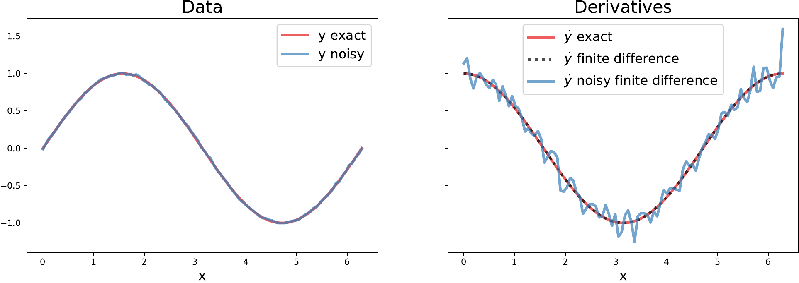

Practical tips
==============

Here we provide pragmatic advice for using PySINDy effectively. We discuss potential pitfalls and strategies for overcoming them. We also specify how to incorporate custom methods not implemented natively in PySINDy, where applicable. The information presented here is derived from a combination of experience and theoretical considerations.

Numerical differentiation
-------------------------

Numerical differentiation is one of the core components of the SINDy method. Derivatives of measurement variables provide the targets (left-hand side :math:`\dot{X}`) for the sparse regression problem solved by SINDy:

.. math::

    \dot{X} \approx \Theta(X)\Xi.

If care is not taken in computing these derivatives, the quality of the learned model is likely to suffer.

By default, a second order finite difference method is used to differentiate input data. Finite difference methods tend to amplify noise in data. If the data are smooth (at least twice differentiable), then finite difference methods give accurate derivative approximations. When the data are noisy, they give derivative estimates with *more* noise than the original data. The following figure visualizes the impact of noise on numerical derivatives. Note that even a small amount of noise in the data can produce noticeable degradation in the quality of the numerical derivative.

    A toy example illustrating the effect of noise on derivatives computed with a second order finite difference method. Left: The data to be differentiated; :math:`y=\sin(x)` with and without a small amount of additive noise (normally distributed with mean 0 and standard deviation 0.01). Right: Derivatives of the data; the exact derivative :math:`\cos(x)` (blue), the finite difference derivative of the exact data (black, dashed), and the finite difference derivative of the noisy data.

One way to mitigate the effects of noise is to smooth the measurements before computing derivatives. The :code:`SmoothedFiniteDifference` method can be used for this purpose.
A numerical differentiation scheme with total variation regularization has also been proposed [Chartrand_2011]_ and recommended for use in SINDy [Brunton_2016]_.

Users wishing to employ their own numerical differentiation schemes have two ways of doing so. Derivatives of input measurements can be computed externally with the method of choice and then passed directly into the :code:`SINDy.fit` method via the :code:`x_dot` keyword argument. Alternatively, users can implement their own differentiation methods and pass them into the :code:`SINDy` constructor using the :code:`differentiation_method` argument. In this case, the supplied class need only have implemented a :code:`__call__` method taking two arguments, :code:`x` and :code:`t`.

Library selection
-----------------

The SINDy method assumes dynamics can be represented as a *sparse* linear combination of library functions. If this assumption is violated, the method is likely to exhibit poor performance. This issue tends to manifest itself as numerous library terms being active, often with weights of vastly different magnitudes, still resulting in poor model error.

Typically, prior knowledge of the system of interest and its dynamics should be used to make a judicious choice of basis functions. When such information is unavailable, the default class of library functions, polynomials, are a good place to start, as smooth functions have rapidly converging Taylor series. Brunton et al. [Brunton_2016]_ showed that, equipped with a  polynomial library, SINDy can recover the first few terms of the (zero-centered) Taylor series of the true right-hand side function :math:`\mathbf{f}(x)`. If one has reason to believe the dynamics can be sparsely represented in terms of Chebyshev polynomials rather than monomials, then the library should include Chebyshev polynomials.

PySINDy includes the :code:`CustomLibrary` and :code:`IdentityLibrary` objects to allow for flexibility in the library functions. When the desired library consists of a set of functions that should be applied to each measurement variable (or pair, triplet, etc. of measurement variables) in turn, the :code:`CustomLibrary` class should be used. The :code:`IdentityLibrary` class is the most customizable, but transfers the work of computing library functions over to the user. It expects that all the features one wishes to include in the library have already been computed and are present in :code:`X` before :code:`SINDy.fit` is called, as it simply applies the identity map to each variable that is passed to it.
It is best suited for situations in which one has very specific instructions for how to apply library functions (e.g. if some of the functions should be applied to only some of the input variables).

As terms are added to the library, the underlying sparse regression problem becomes increasingly ill-conditioned. Therefore it is recommended to start with a small library whose size is gradually expanded until the desired level of performance is achieved.
For example, a user may wish to start with a library of linear terms and then add quadratic and cubic terms as necessary to improve model performance.
For the best results, the strength of regularization applied should be increased in proportion to the size of the library to account for the worsening condition number of the resulting linear system.

Users may also choose to implement library classes tailored to their applications. To do so one should have the new class inherit from our :code:`BaseFeatureLibrary` class. See the documentation for guidance on which functions the new class is expected to implement.

Optimization
------------
PySINDy uses various optimizers to solve the sparse regression problem. For a fixed differentiation method, set of inputs, and candidate library, there is still some variance in the dynamical system identified by SINDY, depending on which optimizer is employed.

The default optimizer in PySINDy is the sequentially-thresholded least-squares algorithm (:code:`STLSQ`). In addition to being the method originally proposed for use with SINDy, it involves a single, easily interpretable hyperparameter, and it exhibits good performance across a variety of problems.

The sparse relaxed regularized regression (:code:`SR3`) [Zheng_2018]_ [Champion_2019]_ algorithm can be used when the results of :code:`STLSQ` are unsatisfactory. It involves a few more hyperparameters that can  be tuned for improved accuracy. In particular, the :code:`thresholder` parameter controls the type of regularization that is applied. For optimal results, one may find it useful to experiment with :math:`L^0`, :math:`L^1`, and clipped absolute deviation (CAD) regularization. The other hyperparameters can be tuned with cross-validation.

Custom or third party sparse regression methods are also supported. Simply instantiate an instance of the custom object and pass it to the :code:`SINDy` constructor using the :code:`optimizer` keyword. Our implementation is compatible with any of the linear models from Scikit-learn (e.g. :code:`RidgeRegression`, :code:`Lasso`, and :code:`ElasticNet`).
See the documentation for a list of methods and attributes a custom optimizer is expected to implement. There you will also find an example where the Scikit-learn :code:`Lasso` object is used to perform sparse regression.

Regularization
--------------
Regularization, in this context, is a technique for improving the conditioning of ill-posed problems. Without regularization, one often obtains highly unstable results, with learned parameter values differing substantially for slightly different inputs. SINDy seeks weights that express dynamics as a *sparse* linear combination of library functions. When the columns of the measurement data or the library are statistically correlated, which is likely for  large libraries, the SINDy inverse problem can quickly become ill-posed. Though the sparsity constraint is a type of regularization itself, for many problems another form of regularization is needed for SINDy to learn a robust dynamical model.

In some cases regularization can be interpreted as enforcing a prior distribution on the model parameters [Bishop_2016]_.
Applying strong regularization biases the learned weights *away* from the values that would allow them to best fit the data and *toward* the values preferred by the prior distribution (e.g. :math:`L^2` regularization corresponds to a Gaussian prior).
Therefore once a sparse set of nonzero coefficients is discovered, our methods apply an extra  "unbiasing" step where *unregularized* least-squares is used to find the values of the identified nonzero coefficients.
All of our built-in methods use regularization by default.

Some general best practices regarding regularization follow. Most problems will benefit from some amount of regularization. Regularization strength should be increased as the size of the candidate right-hand side library grows. If warnings about ill-conditioned matrices are generated when :code:`SINDy.fit` is called, more regularization may help. We also recommend setting :code:`unbias` to :code:`True` when invoking the :code:`SINDy.fit` method, especially when large amounts of regularization are being applied. Cross-validation can be used to select appropriate regularization parameters for a given problem.

.. [Chartrand_2011] R. Chartrand, “Numerical differentiation of noisy, nonsmooth data,” *ISRN Applied Mathematics*, vol. 2011, 2011.

.. [Brunton_2016] S. L. Brunton, J. L. Proctor, and J. N. Kutz, “Discovering governing equations from data by sparse identification of nonlinear dynamical systems,” *Proceedings of the National Academy of Sciences*, vol. 113, no. 15, pp. 3932–3937, 2016.

.. [Zheng_2018] P. Zheng, T. Askham, S. L. Brunton, J. N. Kutz, and A. Y. Aravkin, “A unified framework for sparse relaxed regularized regression: Sr3,” *IEEE Access*, vol. 7, pp. 1404–1423, 2018.

.. [Champion_2019] K. Champion, P. Zheng, A. Y. Aravkin, S. L. Brunton, and J. N. Kutz, “A unified sparse optimization framework to learn parsimonious physics-informed models from data,” *arXiv preprint arXiv:1906.10612*, 2019.

.. [Bishop_2016] C. M. Bishop, Pattern recognition and machine learning. Springer, 2006.
